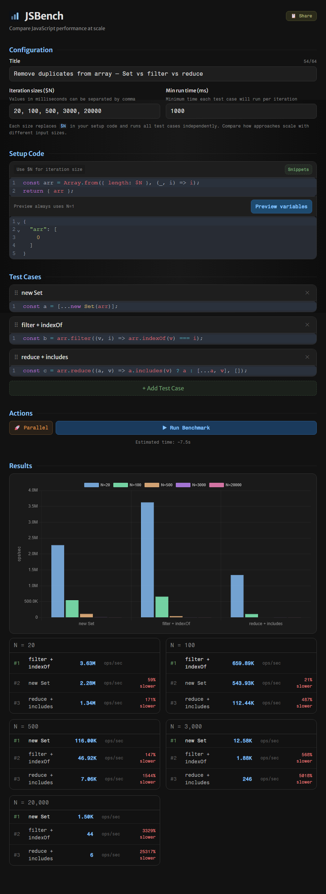

# JSBench — JavaScript Benchmarking Tool

JSBench is a high-performance JavaScript benchmarking tool designed to compare multiple code patterns across varying input sizes.
It executes user-provided code in a clean, isolated environment to provide accurate performance metrics without UI thread interference.

[https://jsbench.icaruk.dev/](https://jsbench.icaruk.dev/)

## Features

- Setup code that runs before each benchmark
- Configurable iteration sizes (e.g. 10, 100, 500, 2000)
- Results displayed as ops/sec with percentage difference from fastest
- Interactive chart visualizing performance across sizes
- Share benchmarks via URL hash
- Web Worker execution with warmup phase, parallel and serial modes
- Drag-and-drop test case reordering
- Configurable minimum run time per test